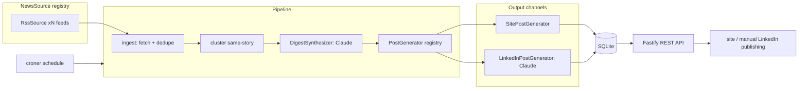

# Architecture

kiko is a single Node.js service built as ports & adapters: every replaceable
capability sits behind an interface in [src/core/ports.ts](../src/core/ports.ts),
and concrete implementations are wired in exactly one place —
[src/container.ts](../src/container.ts).

## Pipeline flow

Run semantics: the synthesis call is the expensive artifact. After the first
post is persisted, items are marked `digested` — a later generator failure
yields a `partial` run instead of paying for synthesis twice. Generators run
independently; one failing doesn't stop the rest.

## Modules

| Module         | Role                                                            | Depends on          |
| -------------- | --------------------------------------------------------------- | ------------------- |
| `core/`        | Domain types, ports, pure logic (dedupe, clustering, citations) | nothing             |
| `sources/`     | `NewsSource` implementations (RSS with conditional GET)         | core                |
| `llm/`         | Anthropic client factory + `ClaudeSynthesizer`                  | core                |
| `generators/`  | One `PostGenerator` per output channel                          | core, llm           |
| `db/`          | Drizzle schema, bootstrap DDL + mini-migrations, repositories   | core                |
| `pipeline/`    | `Pipeline` class — orchestration only, all deps injected        | core (+ repo types) |
| `server/`      | Fastify app: routes, schemas, auth, OpenAPI                     | container           |
| `cli/`         | One-off entry points: run-pipeline, ingest, backup              | container           |
| `container.ts` | Composition root — the only file that knows concrete classes    | everything          |

## Module contract: adding / removing capabilities

**Add a news source** — implement `NewsSource` (`name` + `fetch(options)`),
register the instance in [src/sources/index.ts](../src/sources/index.ts).
Remove the line to plug it out. A throwing `fetch()` skips the source for that
run; it never kills the pipeline.

**Add an output channel** (X, newsletter, …) — implement `PostGenerator`
(`kind` + `generate(synthesis, clusters)`), register in
[src/generators/index.ts](../src/generators/index.ts). The pipeline persists
whatever the generator returns and attributes its token usage per post.

**Swap the synthesizer** — implement `DigestSynthesizer` and wire it in the
container (e.g. a different model or a non-LLM summarizer for tests).

## Data model

Four tables (SQLite, WAL): `news_items` (deduped raw items),
`posts` (generated posts incl. `sources` citation map and `prompt_version`),
`runs` (pipeline run log with token totals), `feed_validators`
(conditional-GET state). `posts_fts` is an FTS5 index maintained by triggers.
Schema evolution: `CREATE TABLE IF NOT EXISTS` bootstrap + idempotent
`ensureColumn` mini-migrations in [src/db/client.ts](../src/db/client.ts).

## Database choice

SQLite now; the analysis and the triggers for moving to Postgres or Turso are
documented in [db-analysis.md](db-analysis.md).
